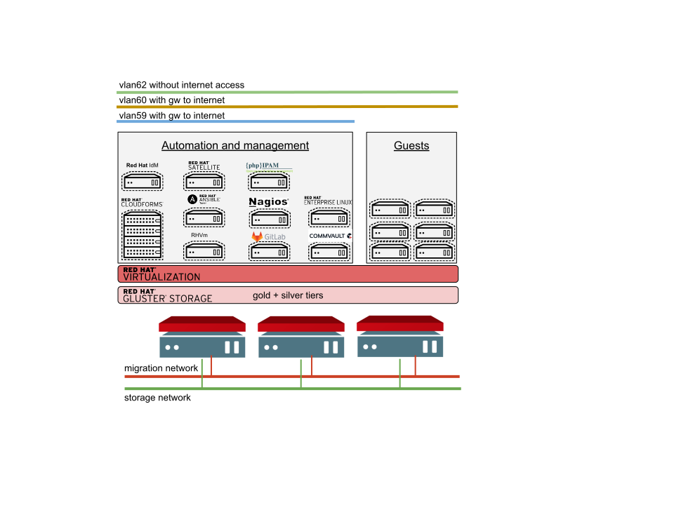

# Lab description

This page describes our lab architecture and components we use there. Playbooks
on our [git repository](https://github.com/RedHatNordicsSA) automate creating
this infra, and vice versa, the tools here utilise the playbooks to create
virtual machines and automation into this lab.

## Lab architecture

We use several tools for automation. Some are Red Hat products and some are
external. Mostly open source projects, except for Commvault.

## We use the following tools to manage the infra

One liner explanation and links to products:

* [Red Hat Virtualization](https://www.redhat.com/en/technologies/virtualization/enterprise-virtualization) - Everything runs on RHV
* RHVm - RHV manager, the manager part of RHV, VM on top of RHV
* [Red Hat Satellite](https://www.redhat.com/en/technologies/management/satellite) - Management and rpm repos
* [Red Hat IdM](https://access.redhat.com/products/identity-management) - Identity managemnt, users, sudo, ssh keys
* [Red Hat Ansible Tower](https://www.ansible.com/products/tower) - Automation tasks orchestration
* [Red Hat CloudForms](https://www.redhat.com/en/technologies/management/cloudforms) - Control, Automation, Visibility, Reporting
* [Red Hat Enterprice Linux](https://www.redhat.com/en/technologies/linux-platforms/enterprise-linux) - VM template
* [phpIPAM](https://phpipam.net/) - IP address management
* [Nagios](https://www.nagios.org/) - monitoring with alerts
* [Gitlab](https://gitlab.com/) - git server for ansible playbooks and roles
* [Commvault](https://www.commvault.com/) - 3rd party backup service

## VM Guests

Virtual machines are created in automated way. See VM creation blog (TBD) how
we use basic Red Hat Enterprise Linux (RHEL) KVM QCOW image from
[access portal](access.redhat.com) as a template. Guests are automatically
brought into management at VM creation time.

See [our blogs](./blogs) about automation.

BR, [Ilkka Tengvall](https://twitter.com/ikkeT)

[back to frontpage](./)
